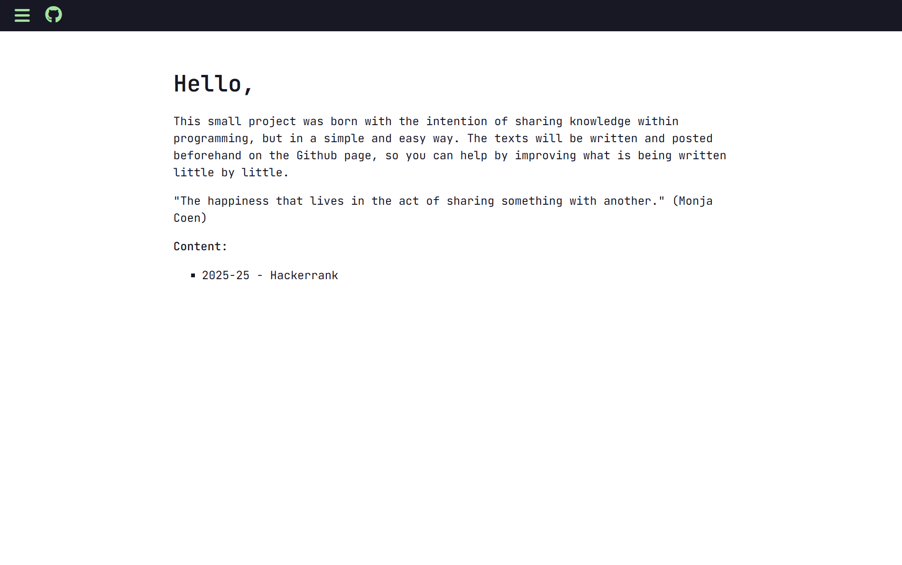
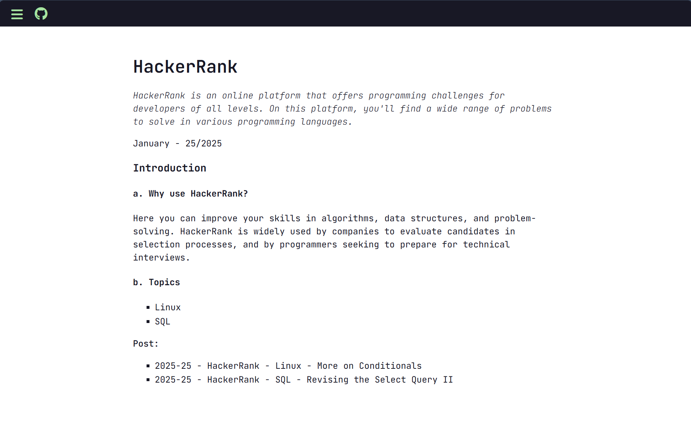

## 💻 [foj.dev.br](http://foj.dev.br)

Ao longo do tempo de faculdade percebi que gostava de escrever e explicar as coisas que aprendia, esse desejo junto da vontade de colocar meus conhecimentos de Front-end em prática, me fizeram criar esse projeto. Esse pequeno projeto nasce com o intuito de compartilhar conhecimentos dentro da programação, mas de uma forma simples e fácil.

Todos os textos são parte dos estudos aprodundados em cada tema, além de pesquisas diversas. As publicações acontecem a cada 15 dias!

## 🗂️ Conteúdos
Os artigos e textos escritos seguem sendo feitos com base a abordar alguns temas voltados para área de tecnologia:
- Hackerrank;

## ✏️ Página

	</a>

	</a>
